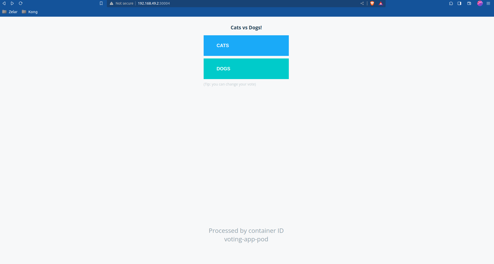

# deploying microservices on Kubernetes

## installed kubctl and minikube in local machine
- created group using `sudo usermod -aG docker $USER && newgrp docker`
  
 ## create & run pods and services
 - `kubectl create -f voting-app-pod.yaml`
 - `kubectl create 0f voting-app-service.yaml`
  - added `alias k-kubernetes` in local machine
  - `kubctl get pods,svc`
  - if you not sure about the IP of service you can run the command
  - `minikube service <nameOtheService> --url`
  - example: `minikube service voting-service --url`
  - `http://192.168.49.2:30004`
  - 
  - `k create -f redis-pod.yaml`
  - `k create -f redis-service.yaml`